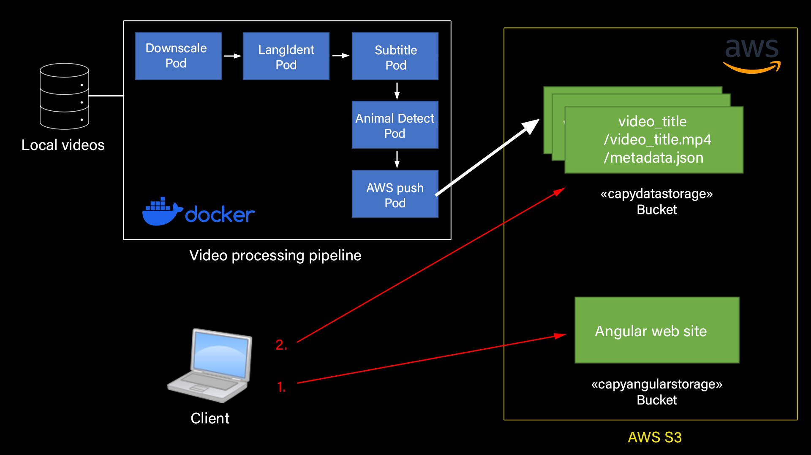

# Cloud Pipeline Video - Projet Cloud

Une vidéo démonstration est disponible au lien suivant :

https://youtu.be/iOOhlNhDuFI

# Description

## General

Le projet permet de traiter une vidéo :
- La vidéo est compressée
- La langue de la vidéo est détectée
- Les sous-titres corespondants sont ajoutés sur la vidéo
- Les animaux présents sur la vidéo sont détectés et affichés sur la vidéo

A partir d'une vidéo original, on créer alors :
- Une vidéo avec les sous-titres et la detection d'animaux 
- Un fichier JSON contenant les metadatas de la vidéo (langue, liste des animaux detectés)

Après traitement, ces données sont accessibles depuis un site web.

On retrouve alors sur le site web :
- Toutes les vidéos traités sur la page d'accueil
- La possibilité, pour chaque vidéo, de lire la vidéo traité et de visualiser les metadatas

## En détail

Le projet suit l'infrastructure du schéma suivant :

1. La pipeline vidéo séléctionne d'abord la vidéo présente dans le dossier local spécifié.

2. Chaque vidéo passe dans la pipeline. Elle est compressée, les sous-titres, la langue et les animaux sont détectés.

3. Le dernier pod de la pipeline créer dans AWS S3 un bucket "capydatastorage" un dossier par vidéo.

4. Dans chaque dossier, il y a la vidéo transformée, et un fichier JSON contenant les metadatas de la vidéo.

5. Le deuxième bucket "capyangularstorage" contient le site web, développé en Angular.

6. Lorsque le client se connecte à son adresse, il récupère le site web.

7. Lorsque le site web s'affiche, il utilise aws-sdk pour récuperer tout le contenu du bucket "capydatastorage".

8. Il y extrait alors chaque dossier, et créer un onglet sur le front-end pour chaque dossier.

9. Lorsque le client clique sur un des onglets, Angular récupère le contenu du dossier associé dans le bucket, c'est à dire la vidéo et le JSON.

10. Enfin, il affiche la vidéo, extrait les metadatas contenues dans le JSON et les affiche.
    
# Deploiement

## Docker

Pour ce projet, Docker est utilisé afin de créer divers conteneurs pour chaque étape d'analyse de la vidéo. Ces conteneurs serviront à mettre en place la séquence de traitement de la vidéo. Il y a 5 conteneurs pour chaque étape, contenant chacun un script nécessaire à la réalisation du traitement, un fichier Dockerfile pour la création du conteneur, et un fichier requirements contenant les différentes bibliothèques requises pour exécuter les scripts Python :
- Downscale: Ce conteneur comprime la vidéo pour réduire sa taille.
- LangIdent: Ce conteneur identifie le langage de la vidéo.
- Subtitle: Ce conteneur crée et ajoute des sous-titres directement sur la vidéo.
- AnimalDetect: Ce conteneur détecte les animaux présents dans la vidéo et les identifie.
- PushAWS: Ce conteneur est chargé de transférer la vidéo traitée avec les différents processus dans le bucket AWS.

Enfin, pour exécuter la séquence de ces conteneurs, le fichier Docker Compose se charge de lancer les pods les uns après les autres.

Pour tester le système, il suffit d'insérer la vidéo souhaitée dans le dossier src/ressources, puis de lancer Docker Compose avec la commande "docker compose up --build". Une fois le processus terminé, la vidéo finale devrait être disponible dans le dossier src/results/nomVideo_detection.mp4.

## Site web

Le site web est disponible au lien suivant :

http://capyangularstorage.s3-website.eu-north-1.amazonaws.com/

# Détail de l'implémentation

## Compression

Utilisation de la librairie MoviePy (Python)

## Langue

Utilisation de la librairie MoviePy (Python)

## Sous-titres

Pour l'ajout des sous-titres à la vidéo, même traitement que pour l'identification de la langue, consistant à extraire le texte à partir de l'audio de la vidéo. Ensuite, le texte est segmenté en plusieurs parties, avec une fréquence de découpe toutes les 4 secondes, afin de pouvoir l'afficher correctement sur la vidéo. Pour intégrer ces sous-titres directement à la vidéo, utilisation de la bibliothèque FFMEP, qui génère une nouvelle vidéo combinant la vidéo d'origine et le fichier de sous-titres créé précédemment.

## Detection d'animaux

Utilisation de YOLO version 5 (YOLOv5)

### Entrainement du modèle

- 1 : création de dossiers contenant des images diverses des animaux que nous souhaitons pouvoir reconnaître sur les vidéos (plus le dossier contient d'images plus les résultats seront précis)
  
- 2 : utilisation du site makesense.ai afin d'annoter les images selon les animaux qu'elles contiennent et export de ces annotations au format YOLO

- 3 : clônage et utilisation du dépôt GitHub YOLOv5
  
- 4 : ajustement des paramètres et entrainement avec le script train.py de YOLOv5

### Détection d'animaux

- 1 : ajustement des paramètres, mention de la vidéo qui doit faire objet de détection

- 2 : détection grâce au script detection.py de YOLOv5

- 3 : génération de la vidéo avec son et génération d'un JSON récapitulant les animaux détectés dans la vidéo
  
## AWS Push

Utilisation de la librairie Boto3.

## AWS S3

Il y a 2 buckets dans AWS S3 :
- Le bucket "capydatastorage", qui contient toutes les vidéos et les metadonnées
- Le bucket "capyangularstorage", qui contient le site web accessible par le client

## Angular

Le site web est développé en Angular.

Utilisation de la librairie AWS "aws-sdk" pour se connecter à AWS et récupérer tout le contenu du Bucket "capydatastorage".

Une fois le contenu entier du Bucket récupéré, pour chaque dossier l'url de sa vidéo et de son fichier JSON est récupéré.

Pour récuperer le contenu du fichier JSON, utilisation du service HTTP et la méthode GET sur l'url du JSON.
